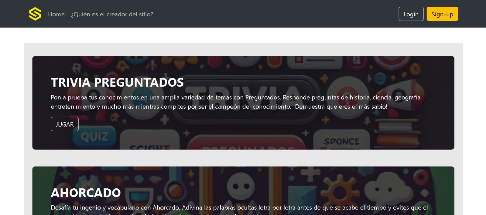
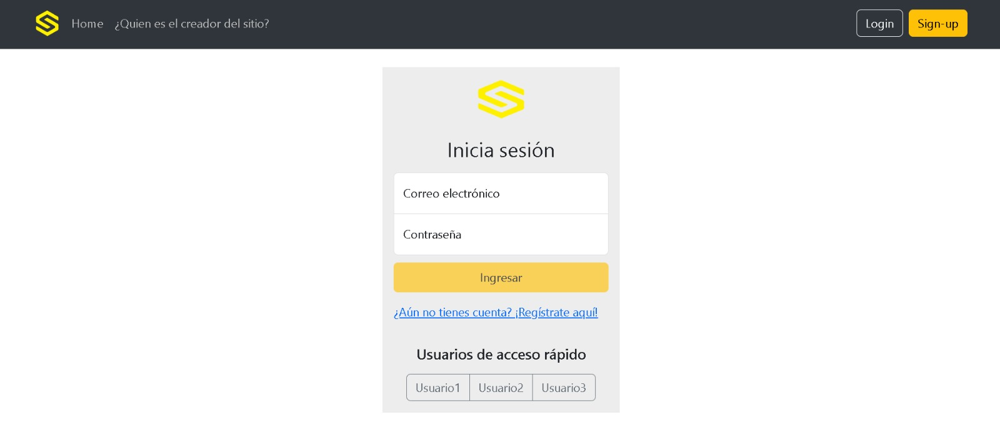
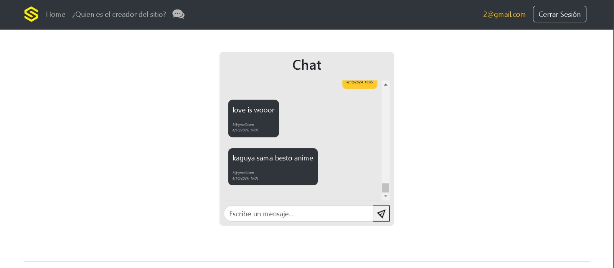
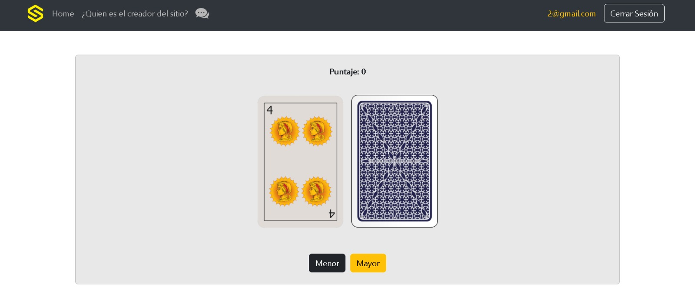
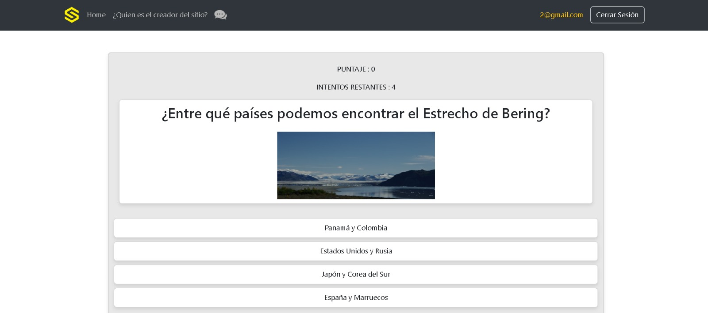
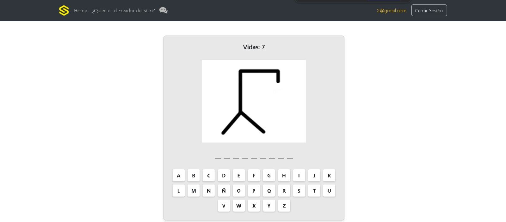

# SalaDeJuegos

SalaDeJuegos es un proyecto hecho con angular el cual contiene diferentes funcionalidades de acceso rápido, facil y divertido...

## Link 
https://sala-de-juegos-guevara.web.app/home

## Funcionalidades

La sala de juegos en si misma tiene diferentes componentes entre los cuales se incluyen el inicio de sesión y el registro... Una vez estén las credenciales validadas, se podrá acceden a 4 juegos diferentes todos con sus particularidades y lógica interna como por ejemplo el preguntados trivia el cual está hecho pegandole a 2 apis distintas. También, el sitio cuenta con un chat sincrónico para que todos los usuarios puedan enviar mensajes al estilo WhatsApp.

## Fotos 

